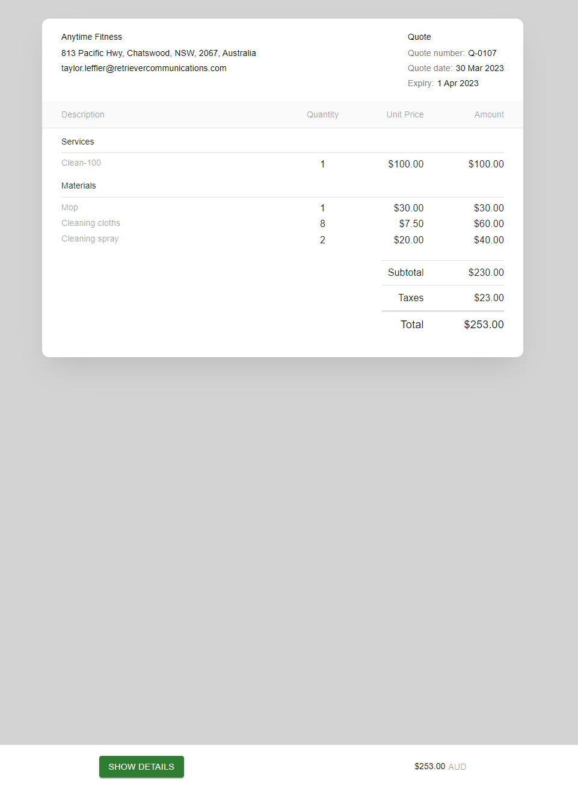
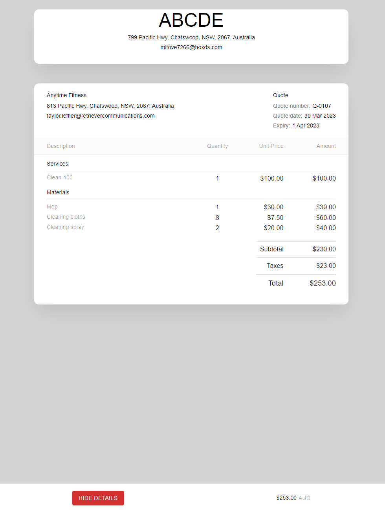

#### Instructions
You will be implementing a React component that shows a work quote to a customer, by fetching its data from a REST endpoint and displaying it in a styled component. We will provide a React project skeleton that already has a number of recommended library dependencies installed (MaterialUI, Axios, Lodash).

You will be assessed on your:
* Implementation of the functionality required
* Use of good code patterns for maintainability, reusability, performance
* Use of common React core features, suggested libraries and typescript implementation
* Styling and responsiveness of the component
* Testing of the component 

#### Requirements
You will be fetching data from a REST GET endpoint at:

https://servis-devau.retrieverdev.net/quotemanagement/api/unauthenticated/v1/quotes/preview/${quoteId}

quoteId = cfd708724351461887e3fa2ced5b3a83kEH-sv7HdVZsawDs5pcp_BrE2B_Ct7sF

The data format of the response will be: 

```
Quote
  recipientName: optional string
  recipientEmail: optional string
  recipientPhone: optional string
  address: optional Address
  quoteNumber: optional string
  reference: optional string
  dateCaptured: optional string
  expiry: optional string
  subtotal: optional floating point number
  taxTotal: optional floating point number
  total: optional floating point number
  notes: optional string
  lineItems: a list of LineItem objects
  orgHeader: optional OrgHeader object


Other object types
Address
  address1: optional string,
  address2: optional string,
  suburb: optional string,
  state: optional string,
  country: optional string,
  postcode: optional string,

LineItem
  taxCode: optional string
  account: optional string
  type: optional BillableItemsType object
  salesDescription: optional string
  unitAmount: optional floating point number
  saleCost: optional floating point number

BillableItemsType
  One of 'MISC', 'MATERIALS', 'SERVICE', 'LABOUR'

OrgHeader
  orgLogoUrl: optional SignedUrl object
  orgName: required string
  address: required Address
  email: required string
  phone: optional string

SignedUrl
  url: required string
  secondsUntilExpiration: required integer
```

#### UI design / screenshot
You aim is to get the component looking close to the following screenshots





#### Steps
1. Implement a call to the REST endpoint (using the Axios library), using promises to handle the response to be used by the component. Create and use any sub components or type declarations where appropriate
2. Implement the table label and value fields to display the data from the object that was fetched from the REST API (i.e. field1, field2). Please use MaterialUI components where possible React Components - Material UI 
3. Match the styling to the screenshot as close as you can, while maintaining clean styling code
4. Implement a way to expand / collapse the additional details fields, which shows the customer details
5. Add a search filter on the line items to filter on the type, add sorting to the line items

BONUS: Write some unit tests for your component
